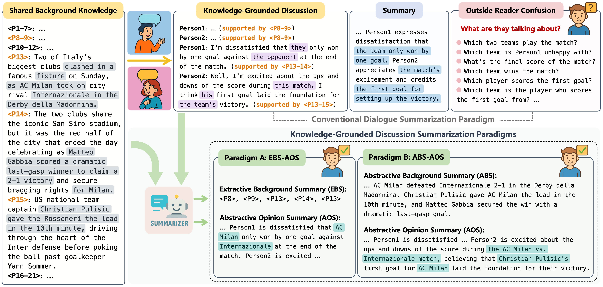
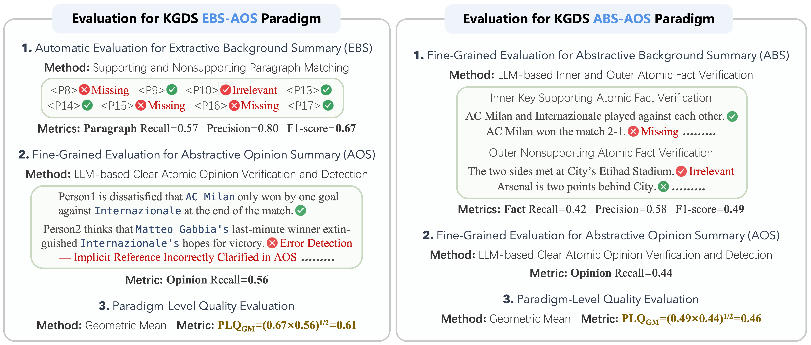

# KGDS
**Knowledge-Grounded Discussion Summarization (KGDS)** is a novel task designed to produce a **supplementary background summary** and a **clear opinion summary** by integrating shared background knowledge with the discussion content. The goal is to create reader-centered summaries by bridging knowledge gaps with necessary background-supporting information and presenting clear participant opinions with clarified implicit references.



## 📊 Benchmark Dataset
The official dataset is available at `benchmark/KGDS.json`. The file contains a list of JSON objects, where each object has the following fields:
* `SBK`: **S**hared **B**ackground **K**nowledge (news domain).
* `KGD`: **K**nowledge-**G**rounded **D**iscussion.
* `BSP`: **B**ackground-**S**upporting **P**aragraphs.
* `CAO`: **C**lear **A**tomic **O**pinions.
* `BSPAF`: **B**ackground-**S**upporting **P**aragraph **A**tomic **F**acts. Those annotated with `"type": 1` are **Key Background-Supporting Atomic Facts**.
* `BNPAF`: **B**ackground-**N**onsupporting **P**aragraph **A**tomic **F**acts. Those labeled with `"type": 0` are **Background-Nonsupporting Atomic Facts**.

## ⚙️ Evaluation Framework
Our evaluation framework provides a comprehensive and hierarchical assessment of the generated summaries. It independently evaluates the sub-summaries (background and opinion) using fine-grained, interpretable metrics and then aggregates these scores to determine the overall quality at the paradigm level.



🚀 *Now, you can reproduce the automatic evaluation results reported in our paper by following the steps below:*

**Step 1:** Download the `outputs.zip` file from either [**Baidu Netdisk**](https://pan.baidu.com/s/1uPcbjQcOQmnEKfpXFBFMXw?pwd=a8x9) (Password: `a8x9`) or [**Google Drive**](https://drive.google.com/file/d/1UcYQ6ZyNq1i1QDI7iSKsscuHR4AHiU4N/view?usp=share_link) and unzip it into the root directory of this project.

**Step 2:** Run the `paradigms.py` script. You can specify the task paradigm, the LLM (from a selection of 12), and the prompt pattern.
```bash
# Example 1: ebs-aos paradigm with gpt-4o
python paradigms.py --paradigm ebs-aos --model gpt-4o --prompt structured-prompt

# Example 2: abs-aos paradigm with gpt-4o-mini
python paradigms.py --paradigm abs-aos --model gpt-4o-mini --prompt structured-prompt

# Example 3: abs-aos paradigm with deepseek-v3 and self-reflection prompt
python paradigms.py --paradigm abs-aos --model deepseek-v3 --prompt self-reflection
```

**Step 3:** Run the `errors.py` script. The options for task paradigm, LLM, and prompt pattern are the same as in the previous step.
```bash
# Example 1: ebs-aos paradigm with llama-3.1-405b
python errors.py --paradigm ebs-aos --model llama-3.1-405b --prompt structured-prompt

# Example 2: abs-aos paradigm with claude-3.5-sonnet
python errors.py --paradigm abs-aos --model claude-3.5-sonnet --prompt structured-prompt

# Example 3: abs-aos paradigm with qwen-max and self-reflection prompt
python errors.py --paradigm abs-aos --model qwen-max --prompt self-reflection
```

## 🤝 Support
If you have any questions, please feel free to reach out:
* **Email**: [wxzhou@buaa.edu.cn](mailto:wxzhou@buaa.edu.cn)
* **GitHub Issues**: Submit your questions or feedback on the issues page of this repository.

## ✍️ Citation
If you find this work useful and have used the code or data, please cite the following paper:
```bibtex
@article{zhou2025they,
  title={What are they talking about? Benchmarking Large Language Models for Knowledge-Grounded Discussion Summarization},
  author={Zhou, Weixiao and Zhu, Junnan and Li, Gengyao and Cheng, Xianfu and Liang, Xinnian and Zhai, Feifei and Li, Zhoujun},
  journal={arXiv preprint arXiv:2505.12474},
  year={2025}
}
```
